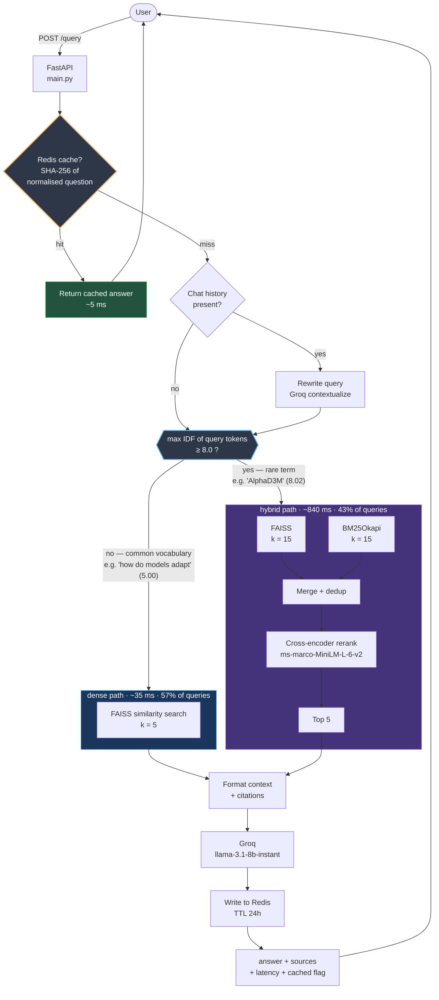
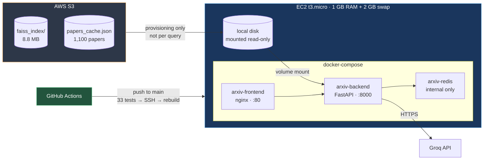

# ArXiv RAG — retrieval evaluation on a 1,100-paper corpus

A question-answering system over ArXiv abstracts, built primarily as a vehicle
for **measuring** retrieval rather than just assembling it. The interesting
part of this repo is not the pipeline — it is the evaluation harness that
showed the original pipeline was worse than a naive baseline, and the routing
strategy that came out of fixing it.

**Live:** http://35.153.168.93

---

## What the evaluation found

The system originally ran multi-query expansion → hybrid retrieval (FAISS +
BM25) → cross-encoder reranking. Measured against hand-verified ground truth,
that configuration scored **42.9% Recall@3**. Plain FAISS similarity search
scored **82.1%**.

Two causes, found in order:

**1. A relevance threshold on raw cross-encoder logits.**
`RELEVANCE_THRESHOLD = 0.0` filtered reranked results, but `ms-marco-MiniLM-L-6-v2`
emits unbounded logits where relevant passages routinely score negative. The
filter was applied twice (once inside `hybrid_search`, again in the multi-query
wrapper), collapsing the result set to ~2 documents per query. Removing it took
hybrid from 42.9% → 72.6%.

**2. The reranker itself does not transfer to this corpus.**
Even unfiltered, reranking lost to dense-only at every candidate-pool size
tested (15 / 30 / 60). `bge-reranker-base` was worse still — 61.9% at 18s per
query on CPU. Score-distribution analysis explained why: BGE scored correct
retrievals at median 0.295 and incorrect ones at 0.246, with misses ranging up
to 0.865. The distributions overlap almost entirely, so the reranker carries
essentially no usable relevance signal here.

| configuration | Recall@3 | latency |
|---|---:|---:|
| dense only (FAISS) | **82.1%** | 33 ms |
| dense + rerank (pool 30) | 77.4% | 1,019 ms |
| dense + rerank (pool 15) | 76.2% | 526 ms |
| dense + rerank (pool 60) | 75.0% | 1,689 ms |
| hybrid + rerank | 73.8% | 846 ms |
| BM25 only | 52.4% | 16 ms |
| multi-query + hybrid + rerank *(original)* | 42.9% | 2,022 ms |

*42 paraphrase-style questions, ground truth verified present in the corpus.*

---

## …and then the opposite result

A second eval set, built around rare technical terms appearing in abstract
bodies but **not** in paper titles, reversed the ordering completely:

| configuration | Recall@3 |
|---|---:|
| hybrid + rerank | **93.3%** |
| hybrid, no rerank | 86.7% |
| BM25 only | 83.3% |
| dense only | 76.7% |

*30 questions. Each stage contributes: BM25 +6.6, rank fusion +3.4, reranking +6.6.*

Neither strategy dominates. Dense embeddings compress a whole chunk into one
vector, which smooths away low-frequency tokens that carry little semantic
weight but high discriminative power. Exact term matching does not smooth.
Reranking only helps when the candidate pool is genuinely ambiguous — on
paraphrase queries the pool is already clean, so reranking has nothing to fix
and only noise to add.

---

## The router

Since the winning strategy depends on the query, the production retriever picks
per query using the **maximum IDF over query tokens** — a value BM25 already
computes for the whole vocabulary:

```
max_idf(query) >= 8.0  ->  hybrid (FAISS + BM25 -> cross-encoder rerank)
otherwise              ->  dense  (FAISS similarity search)
```

```
"What is AlphaD3M?"                   idf 8.02  ->  hybrid
"How do models adapt to new tasks?"   idf 5.00  ->  dense
```

Classification cost is a tokenize plus dictionary lookups — sub-millisecond,
no model call.

| strategy | Recall@3 | mean latency |
|---|---:|---:|
| always dense | 79.9% | 34 ms |
| always hybrid | 81.9% | 834 ms |
| **router (T = 8.0)** | **85.4%** | **381 ms** |
| router (T = 6.0) | 86.1% | 709 ms |

*72 questions (paraphrase + rare-term sets combined).*

T = 8.0 ships: it gives up 0.7 points — one question, inside noise at n=72 —
for 46% lower mean latency, routing 43% of queries to the hybrid path.

---

## Honest caveats

These matter more than the numbers above, and are stated here rather than
buried:

- **The router threshold was selected by sweeping the full evaluation set,
  not a held-out split.** 85.4% is therefore an optimistic estimate. The
  non-monotonic sweep (86.1 → 84.7 → 85.4 across T = 6/7/8) suggests some of
  that variation is noise. A train/test split is the next correction.

- **The rare-term eval set was deliberately constructed to favour lexical
  retrieval.** It is a stress test, not a model of real query distribution.
  It is reported alongside the paraphrase set, never in place of it.

- **A third eval set (50 entity-style questions) saturated at 98–100% across
  every configuration** and is retained in the repo but excluded from
  conclusions — it carried no discriminative signal. Cause: every chunk begins
  with `Title: ...`, and those questions reused title tokens.

- **Sample sizes are small.** n = 42 and n = 30. One question moves Recall@3
  by 2.4 and 3.3 points respectively. Margins under ~7 points should be read
  as noise.

- **An earlier reported figure of 88.89% Recall@3 was invalid** and has been
  retracted. Seven of its nine ground-truth paper IDs did not exist in
  `papers_cache.json`, so retrieval could not have returned them. `evaluate.py`
  now refuses to run unless every labelled ID is verified present in the corpus.

- **The corpus is topically scattered** — federated learning, meta-RL,
  healthcare ML, geospatial ML — which makes dense separation unusually easy.
  Canonical papers (Attention Is All You Need, BERT, the original LoRA and DPR
  papers) are absent, so some questions the UI suggests cannot be answered
  well. A single-domain rebuild is outstanding work.

---

## Architecture



### Why the router exists

Retrieval strategy is query-dependent — neither approach dominates:

| eval set | dense | hybrid + rerank |
|---|---:|---:|
| paraphrase queries (n=42) | **82.1%** | 73.8% |
| rare-term queries (n=30) | 76.7% | **93.3%** |

Dense embeddings compress a chunk into a single vector, smoothing away
low-frequency tokens that carry little semantic weight but high discriminative
power. Exact term matching does not smooth. Max-IDF over query tokens separates
the two cases at negligible cost — one tokenize plus dictionary lookups against
the BM25 vocabulary that already exists in memory.

### Infrastructure



S3 holds the durable copy of the index; EC2 pulls it to local disk once at
provisioning and serves every query from memory. A FAISS search is single-digit
milliseconds against an in-memory index versus 50–200 ms for an S3 GET, and
FAISS memory-maps from a real file path, which object storage cannot provide.

Redis is not published to the host — the backend reaches it by service name on
the Docker network. Publishing 6379 had exposed an unauthenticated Redis to the
public internet.

---

## Running it

```bash
git clone https://github.com/raghulsiddarath09/arxiv-rag.git
cd arxiv-rag

# FAISS index and papers_cache.json are gitignored (binary artifacts);
# pull them from S3 or regenerate.
aws s3 sync s3://arxiv-rag-papers-559987919874/faiss_index/ ./faiss_index/
aws s3 cp   s3://arxiv-rag-papers-559987919874/papers_cache.json .

echo "GROQ_API_KEY=..." > .env
docker-compose up -d --build
```

Frontend on `:80`, API on `:8000`. Redis is internal to the Docker network and
is deliberately not published to the host.

### Reproducing the evaluation

```bash
docker exec -it arxiv-backend python evaluate.py                    # baseline
docker exec -it arxiv-backend python evaluate_configs.py            # ablation
docker exec -it arxiv-backend python evaluate_pool.py               # pool sizes
docker exec -it arxiv-backend python evaluate_bge.py                # BGE reranker
docker exec -it arxiv-backend python evaluate_router.py \
    --sets eval_dataset.json eval_dataset_abstract_rare.json        # router sweep
```

Every script verifies that all ground-truth paper IDs exist in the corpus
before measuring, and exits non-zero if any do not. Raw per-question results
are committed as `eval_results_*.json`.

---

## Tests

33 tests, `main.py` at 83% statement coverage.

`rag_pipeline.py` is not included in the coverage figure: `test_api.py`
installs a mock at `sys.modules['rag_pipeline']` so the suite runs in ~1s
instead of ~45s. Its routing logic is covered separately by
`test_router.py` against a stubbed IDF table, plus one integration test
that exercises the live BM25 vocabulary when the index is available.

```bash
pytest test_api.py test_router.py --cov=main
```

`test_api.py` (17) mocks the retrieval pipeline so the API layer — routing,
validation, caching, error handling — is exercised without loading FAISS or
calling Groq. `test_router.py` (16) covers the routing decision rule:
threshold boundaries, out-of-vocabulary tokens, empty and punctuation-only
queries, case handling. One integration test exercises the live BM25
vocabulary and skips when the index is unavailable or when `test_api.py` has
already installed its mock.

CI runs both suites and blocks deployment on failure; deploys are verified by
a post-deploy health check.

---

## Outstanding

- Held-out validation split for the router threshold
- Single-domain corpus rebuild — current corpus cannot answer the questions
  the UI suggests
- Answer-quality evaluation (faithfulness, citation accuracy); everything
  measured so far is retrieval-only
- Elastic IP — the public address is currently ephemeral
