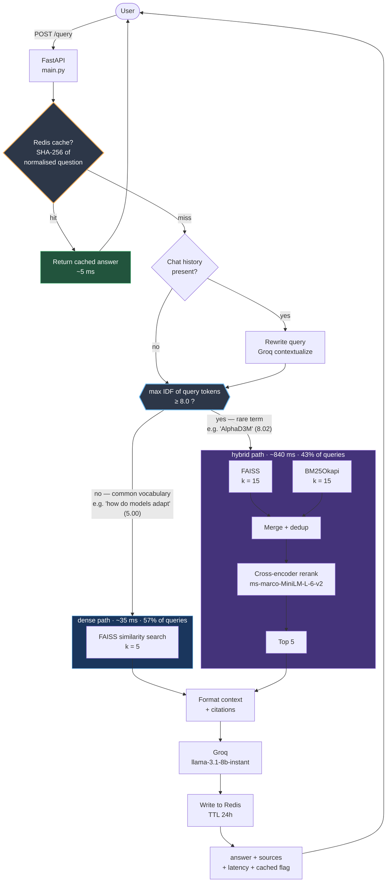
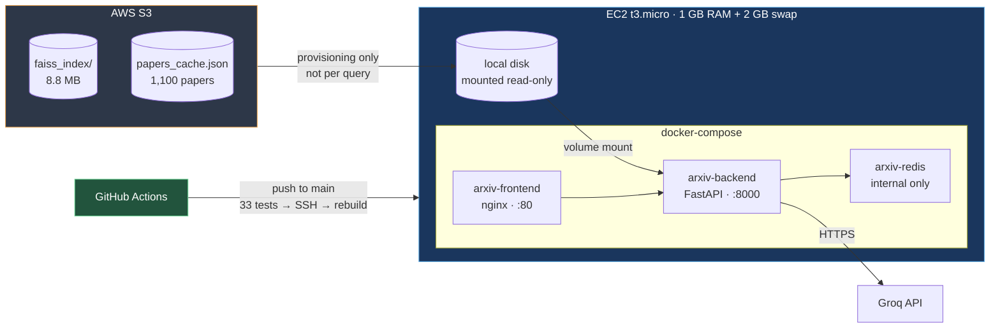

## Architecture

### Why the router exists

Retrieval strategy is query-dependent — neither approach dominates:

| eval set | dense | hybrid + rerank |
|---|---:|---:|
| paraphrase queries (n=42) | **82.1%** | 73.8% |
| rare-term queries (n=30) | 76.7% | **93.3%** |

Dense embeddings compress a chunk into a single vector, smoothing away
low-frequency tokens that carry little semantic weight but high discriminative
power. Exact term matching does not smooth. Max-IDF over query tokens separates
the two cases at negligible cost — one tokenize plus dictionary lookups against
the BM25 vocabulary that already exists in memory.

### Infrastructure

S3 holds the durable copy of the index; EC2 pulls it to local disk once at
provisioning and serves every query from memory. A FAISS search is single-digit
milliseconds against an in-memory index versus 50–200 ms for an S3 GET, and
FAISS memory-maps from a real file path, which object storage cannot provide.

Redis is not published to the host — the backend reaches it by service name on
the Docker network. Publishing 6379 had exposed an unauthenticated Redis to the
public internet.
